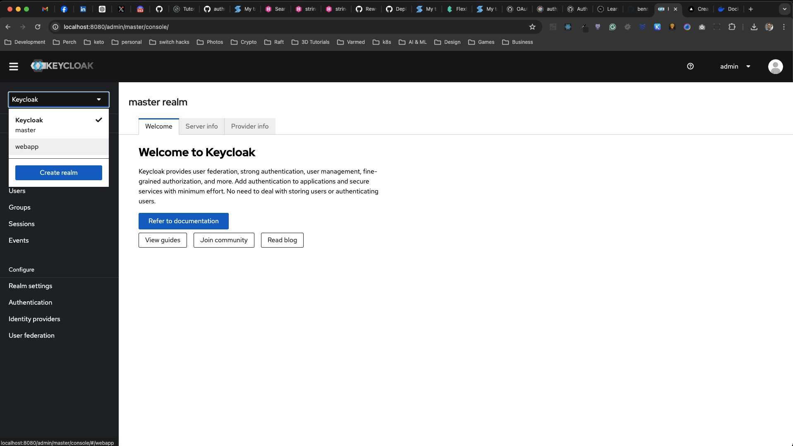
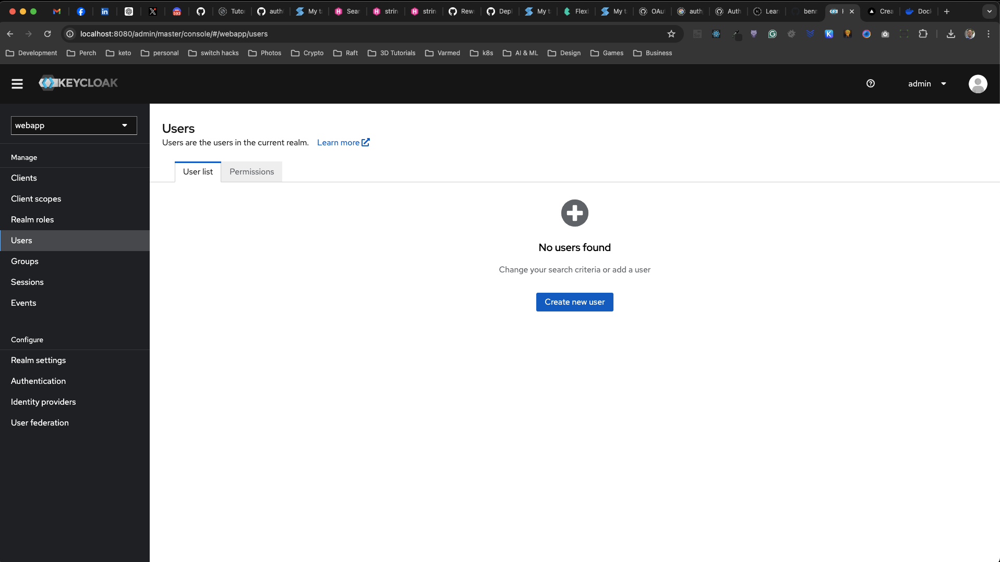
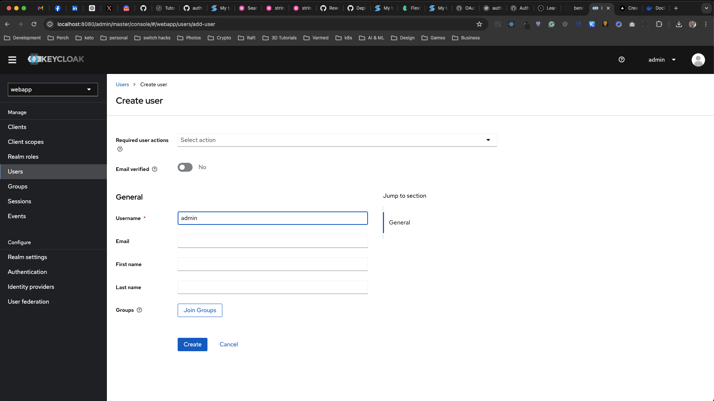
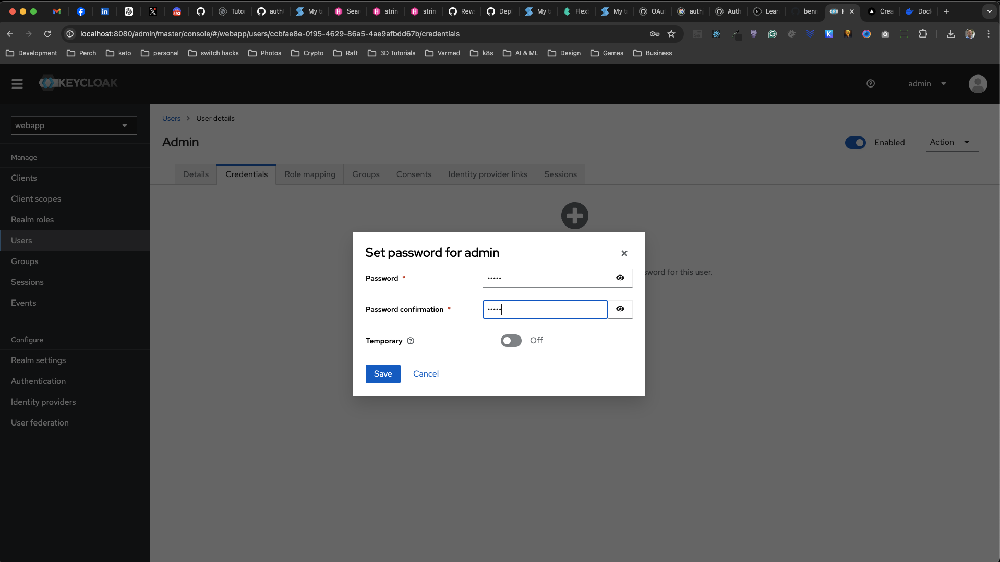
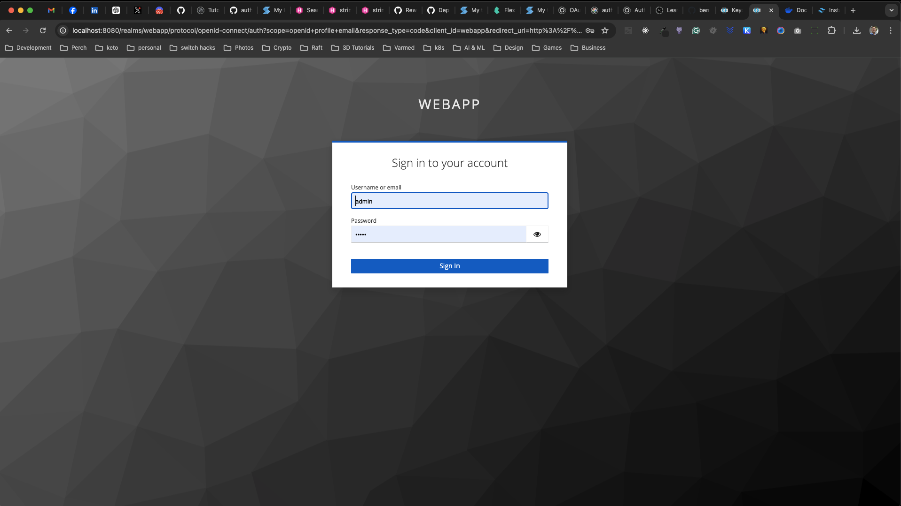
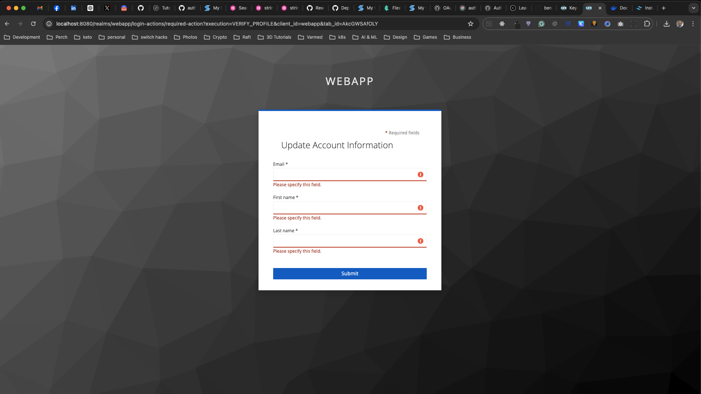
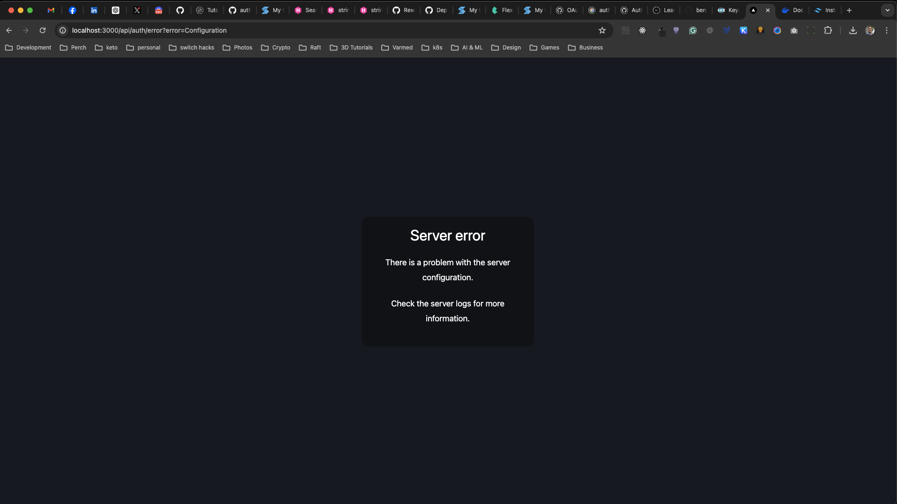
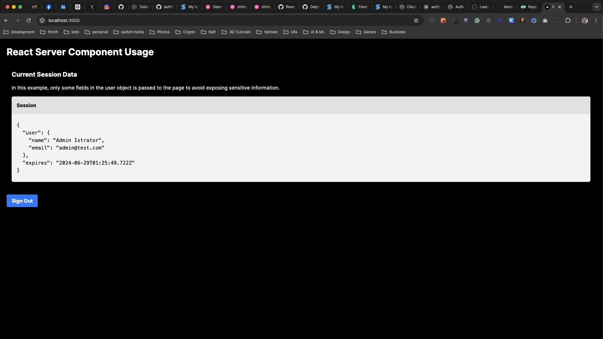

# Nextjs, Authjs and Keycloak in Docker

This is a repo to debug Authjs v5 in Docker to see why it can't login as it should.

Prerequisites:

- [Docker](https://www.docker.com/products/docker-desktop/)
- [Node](https://nodejs.org/en/download/package-manager)

## The problem Authjs does not work when running inside a docker container. If you run Keycloak in Docker and run the webapp locally using `npm run dev` everything works as it should

## How to test in Docker

> Make sure to rename `.env.example` to `.env.local` otherwise you won't be able to load any of the environement variables

Run `docker-compose -f docker-compose-webapp.yml up` this will spin up 3 containers:

- keycloak: runs the keycloak instance
- keycloak-postgres: runs the postgres database for keycloak
- webapp: runs the nexjs app

## Create a user for the webapp in keycloak

Once keycloak is up and running proceed to login to the keycloak admin interface by visiting `http://localhost:8080` in your browser.

The credentials to login to keycloak are:

```
username: admin
password: admin
```

Once you login proceed to click on the `webapp` realm in the left navigation dropdown.



Then click on `Users`, on the users page click on `Create new user`.



Enter the username you want to use to login to the `webapp` I'm using `admin` to keep it simple.



Once the user is created, click on the `Credentials` tab and click on `Set password`. Enter the `password` you want to use in the `password` and in the `password confirmation` input boxes, uncheck the temporary toggle switch and click `Save` then click on `Save password` to confirm.

This concludes our keycloak setup.



## Logging in to the webapp

Now that you have created the `admin` user proceed to login to the webapp, open `http://localhost:3000` in your browser and click on the `Sign In` button, this will forward you to the keycloak form so you can login to the webapp.

Enter the username and password you used for the user you created in keycloak and click `Sign In`.



The first time you login to the webapp keycloak will ask you to update you account information. Enter the information and click `Submit`



Once you update your account info you will encounter the `ECONNREFUSED` error which prevents you from using the webapp.



I added a logger entry in [auth.ts](./webapp/auth.ts#L21) with some console logs so it's easier to debug the issue in docker.

## How to test running the webapp locally

To run keycloak simply run `docker-compose up` and follow the steps to [Create a user for the webapp in keycloak](#create-a-user-for-the-webapp-in-keycloak), open a second terminal window and make sure you `cd /webapp` and then run `npm run dev` to start the webapp locally.

Use the credentials you used when you created the user in keycloak and you should be able to login without any issues.



## Notes

The docs specify you only need 3 env vars:

```
AUTH_KEYCLOAK_ID
AUTH_KEYCLOAK_SECRET
AUTH_KEYCLOAK_ISSUER
```

Using only these 3 values works fine when running it locally but when you try running it in Docker you will run into an error because authjs is not passing the authorization url and it fails with the same `ECONNREFUSED` error as soon as you click the sign-in button.


Thanks for helping me debug this problem and hopefully we can get Authjs to work in Docker as it should.
