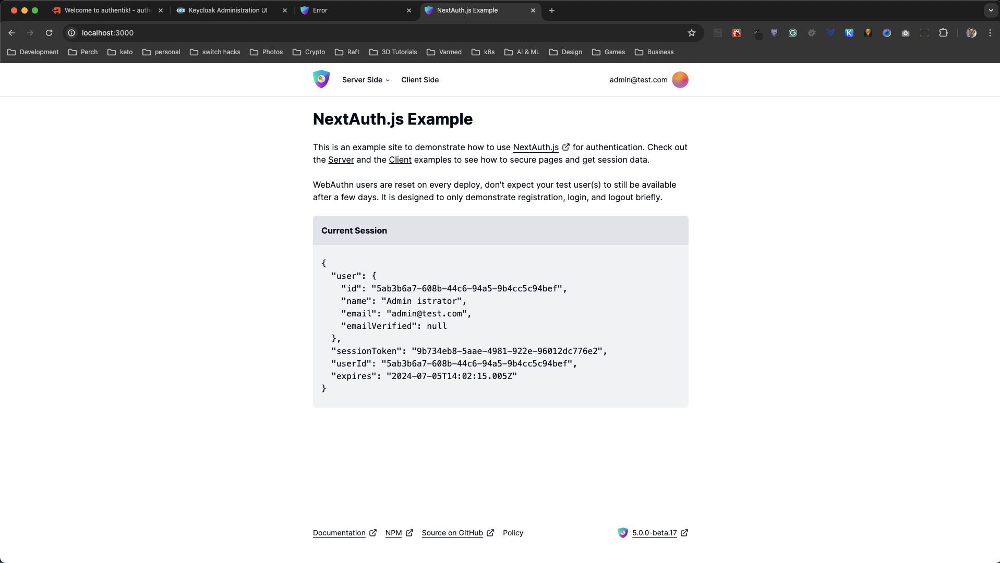

# Next.js, Auth.js, Keycloak, and Authentik in Docker

This repository aims to debug Auth.js v5 in Docker to determine why it doesn't work with the Keycloak provider.

## Table of Contents

1. [Prerequisites](#prerequisites)
2. [Running Authentik and Keycloak in Docker with Local Webapp](#running-authentik-and-keycloak-in-docker-with-local-webapp)
3. [The Auth.js Docker Problem](#the-authjs-docker-problem)
4. [Testing in Docker](#testing-in-docker)
5. [Creating an Application and Provider in Authentik](#creating-an-application-and-provider-in-authentik)
6. [Logging into the Webapp with Authentik](#logging-into-the-webapp-with-authentik)
7. [Testing Authentik in Docker with Local Webapp](#testing-authentik-in-docker-with-local-webapp)
8. [Creating a User in Keycloak](#creating-a-user-in-keycloak)
9. [Logging into the Webapp with Keycloak](#logging-into-the-webapp-with-keycloak)
10. [Testing Keycloak in Docker with Local Webapp](#testing-keycloak-in-docker-with-local-webapp)
11. [Notes](#notes)

---

## Prerequisites

- [Docker](https://www.docker.com/products/docker-desktop/)
- [Node.js](https://nodejs.org/en/download/package-manager)
- Edit your `/etc/hosts` file with the following entries:
  - `127.0.0.1 keycloak.local`
  - `127.0.0.1 webapp.local`
  - `127.0.0.1 authentik.local`

---

## Running Authentik and Keycloak in Docker with Local Webapp

To run both Authentik and Keycloak in Docker, execute the following command:

```sh
docker-compose -f docker-compose-local.yml up
```

Follow the steps to [create a user for the webapp in Keycloak](#creating-a-user-in-keycloak) and [create an application and provider for the webapp in Authentik](#creating-an-application-and-provider-in-authentik).

Then, open a second terminal window and navigate to the project directory:

```sh
cd /nextjs-auth-example
```

Rename `.env.example` to `.env.local`, replace the values for `AUTH_AUTHENTIK_CLIENT_ID` and `AUTH_AUTHENTIK_CLIENT_SECRET` in `.env.local`, and run:

```sh
npm run dev
```

This will start the webapp locally.

Here is a short video demonstrating authentication working when both Authentik and Keycloak are running in Docker and the webapp is running locally. As shown, everything functions correctly with both providers. Now, let's address the issue.

https://github.com/benmarte/authjs-docker/assets/693275/14649d72-7019-4793-b171-f78c716ff27f.mp4

## The Auth.js Docker Problem

Auth.js does not work with the Keycloak provider when running inside a Docker container.

---

## Testing in Docker

Run the following command to start the containers:

```sh
docker-compose up
```

This will spin up 8 containers:

- **authentik**: Runs the Authentik instance
- **keycloak**: Runs the Keycloak instance
- **postgres**: Runs the PostgreSQL database for Keycloak
- **postgresql**: Runs the PostgreSQL database for Authentik
- **redis**: Runs the Redis instance for Authentik
- **traefik**: Runs the Docker reverse proxy
- **webapp**: Runs the Auth.js Docker test app
- **worker**: Runs the Authentik worker

---

## Creating an Application and Provider in Authentik

Once Authentik is up and running, navigate to `http://authentik.local/if/flow/initial-setup/` to create your admin account.


Click "Create new application" and close the modal window. We will use the "Create with wizard" option.


Click on the "Create with wizard" button, enter `webapp` in the name field, and click `next`.


In the "Provider type" dropdown, select `OAuth2/OIDC (Open Authorization/OpenID Connect)` and click `next`.


In the "Provider configuration" section, enter the following:

- **Authentication flow**: `default-authentication-flow (Welcome to Authentik!)`
- **Authorization flow**: `default-provider-authorization-explicit-consent (Authorize Application)`
- **Client type**: `confidential`
- **Client ID**: Copy the generated ID and paste it into the corresponding line in [docker-compose.yml](./docker-compose.yml#L153)
- **Client Secret**: Copy the generated secret and paste it into the corresponding line in [docker-compose.yml](./docker-compose.yml#L154)
- **Redirect/URIs/Origin**: `http://webapp.local/auth/callback/authentik`

> When running the webapp locally, use the following value for Redirect/URIs/Origin: `http://localhost:3000/auth/callback/authentik`


Click `Submit` to finish creating your application and provider. You should see the following success message:


Now, in your terminal where you ran `docker-compose up`, press `Ctrl + C` to stop the containers. Then, run `docker-compose up` again to start the containers with the new changes.

---

## Logging into the Webapp with Authentik

After creating the `admin` user, proceed to log into the webapp. Open `http://webapp.local` in your browser and click the `Sign In` button. You will be redirected to a sign-in page to select your login provider.


Click `Sign in with Authentik`. This will redirect you to the Authentik login page.


Enter your credentials, and you should be redirected to the webapp, where you can see your session information.


---

## Testing Authentik in Docker with Local Webapp

To run Authentik in Docker, execute:

```sh
docker-compose -f docker-compose-authentik.yml up
```

Follow the steps to [create an application and provider for the webapp in Authentik](#creating-an-application-and-provider-in-authentik), open a second terminal window, navigate to the project directory, and rename `.env.example` to `.env.local`. Replace the values for `AUTH_AUTHENTIK_CLIENT_ID` and `AUTH_AUTHENTIK_CLIENT_SECRET` in `.env.local`, and run:

```sh
npm run dev
```

Use the credentials you set when creating the application provider in Authentik to log in without any issues.


---

## Creating a User in Keycloak

Once Keycloak is up and running, log into the Keycloak admin interface by visiting `http://keycloak.local` in your browser.

The credentials to log into Keycloak are:

```sh
username: admin
password: admin
```

After logging in, select the `webapp` realm from the left navigation dropdown.


Then, click `Users` and on the users page, click `Create new user`.


Enter the username you want to use to log into the `webapp`. For simplicity, you can use `admin`.


After creating the user, click the `Credentials` tab and then `Set password`. Enter the desired `password` and `password confirmation`, uncheck the temporary toggle switch, and click `Save`. Confirm by clicking `Save password`.


This concludes the Keycloak setup.

---

## Logging into the Webapp with Keycloak

Log into the webapp with the username and password you set in Keycloak and click `Sign In`.


The first time you log into the webapp, Keycloak will ask you to update your account information. Enter the required information and click `Submit`.


Once you update your account information, you will encounter the `ECONNREFUSED` error, preventing you from using the webapp.


> A logger entry has been added in [auth.ts](./webapp/auth.ts#L21) with console logs to facilitate debugging in Docker.

---

## Testing Keycloak in Docker with Local Webapp

To run Keycloak in Docker, execute:

```sh
docker-compose -f docker-compose-keycloak.yml up
```

Follow the steps to [create a user for the webapp in Keycloak](#creating-a-user-in-keycloak), open a second terminal window, navigate to the project directory, and rename `.env.example` to `.env.local`. Then run:

```sh
npm run dev
```

Use the credentials you set in Keycloak to log in without any issues.



---

## Notes

The documentation specifies that you only need three environment variables:

```sh
AUTH_KEYCLOAK_ID
AUTH_KEYCLOAK_SECRET
AUTH_KEYCLOAK_ISSUER
```

Using only these three values works fine when running locally, but running in Docker results in an error because Auth.js does not pass the authorization URL, leading to the same `ECONNREFUSED` error when clicking the sign-in button.

If you replace the Keycloak provider in [`auth.ts`](./nextjs-auth-example/auth.ts#L72) with the following configuration, you will progress further in the authorization process in Docker, but the error persists.

> Note: When running the web app locally, the Keycloak client needs to be public; otherwise, it will not work with a confidential client in Keycloak. When running Keycloak in Docker, it does not work regardless of whether the client is public or confidential.

```javascript
Keycloak({
  clientId: process.env.AUTH

_KEYCLOAK_ID,
  clientSecret: process.env.AUTH_SECRET,
  issuer: `${process.env.AUTH_KEYCLOAK_ISSUER}`,
  // these are needed in order to have authjs get further in the authorization process in docker
  authorization: `${process.env.AUTH_KEYCLOAK_ISSUER}/protocol/openid-connect/auth`,
  wellKnown: `${process.env.AUTH_KEYCLOAK_ISSUER}/.well-known/openid-configuration`,
  token: `${process.env.AUTH_KEYCLOAK_ISSUER}/protocol/openid-connect/token`,
  userinfo: `${process.env.AUTH_KEYCLOAK_ISSUER}/protocol/openid-connect/userinfo`,
});
```


---

Thank you for helping debug this problem. Hopefully, we can get Auth.js to work in Docker as intended.
